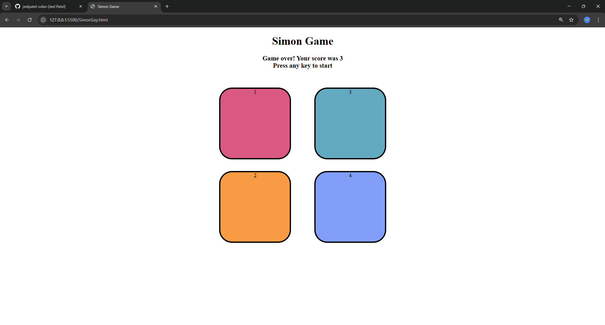

# 🎮 Simon Game

A classic **Simon Says memory game** built using **HTML, CSS, and JavaScript**.
The game tests the player’s memory by generating a sequence of colors that must be repeated in the correct order. The sequence increases with every level, making the game progressively harder.

---

## 🚀 Features

* Interactive color buttons with animations
* Random sequence generation each round
* Level progression system
* Game over detection with score display
* Keyboard start functionality

---

## 🛠️ Technologies Used

* HTML5
* CSS3
* JavaScript (DOM Manipulation & Event Handling)

---

## 🎯 How to Play

1. Press any key to start the game.
2. Watch the sequence of flashing colors.
3. Repeat the sequence by clicking the buttons.
4. Each correct round increases the level.
5. A wrong click ends the game and shows your score.

---

## 📸 Screenshot

(Add your screenshot file in the repo, for example inside an `images` folder, then use:)

---

## 👨‍💻 Author

**Jeel Patel**
MERN Stack Intern 

---
